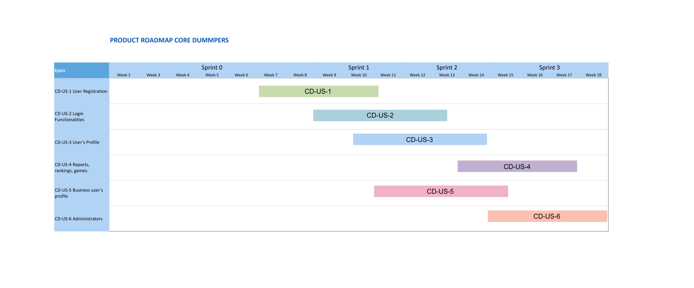
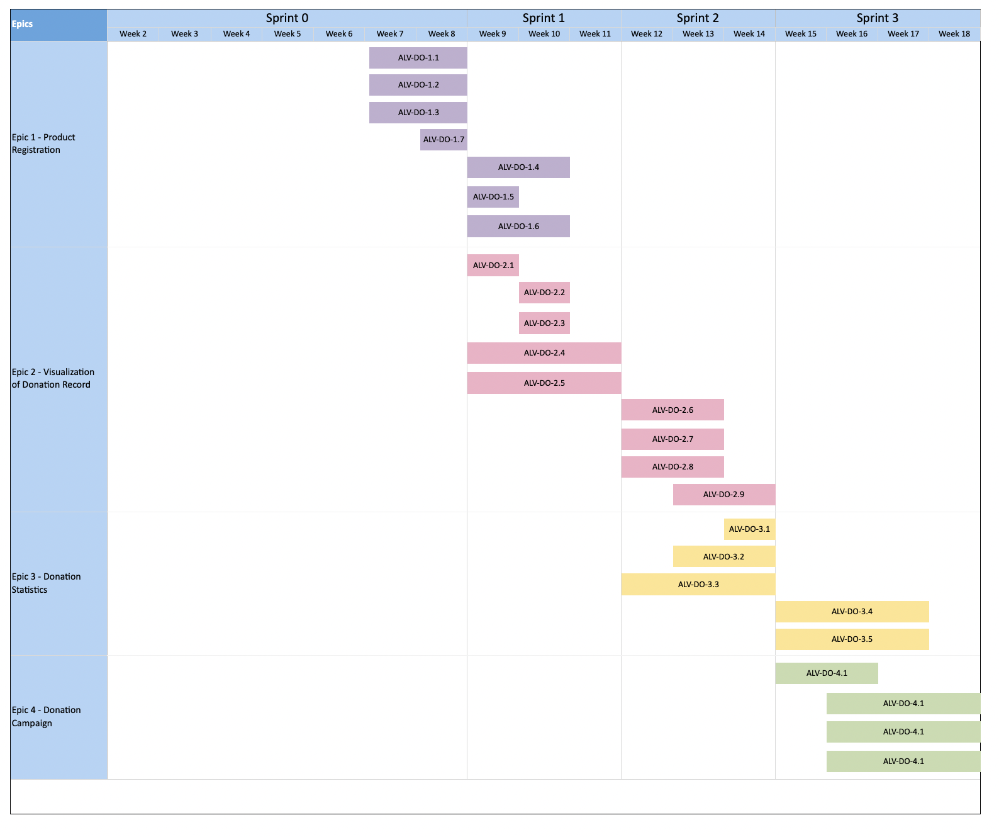
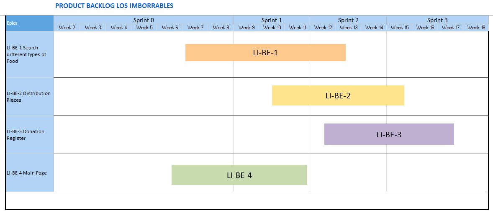
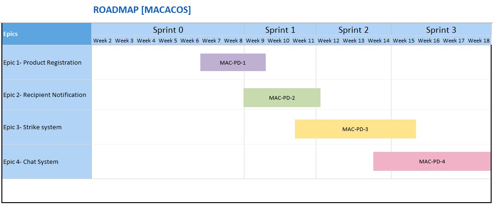

# README #

Universidad de Costa Rica

Escuela de Ciencias de Computación

Conceptualization document

Food Waste

Version 1.0

## Table of contents

* [README](#markdown-header-readme)
	* [Table of contents](#markdown-header-table-of-contents)
	* [Definitions, acronyms and abbreviations](#markdown-header-definitions-acronyms-and-abbreviations)
	* [Introduction](#markdown-header-introduction)
	* [Teams](#markdown-header-teams)
		* [Roles](#markdown-header-roles)
	* [System Overview](#markdown-header-system-overview)
		* [Context and current situation](#markdown-header-context-and-current-situation)
		* [The problem](#markdown-header-the-problem)
		* [Project stakeholders and users types](#markdown-header-project-stakeholders-and-users-types)
		* [Proposed solution](#markdown-header-proposed-solution)
		* [Surrounding analysis](#markdown-header-surrounding-analysis)
			* [Business strategy](#markdown-header-business-strategy)
			* [System objectives from the business perspective](#markdown-header-system-objectives-from-the-business-perspective)
			* [Customers](#markdown-header-customers)
			* [Expected Application Usage](#markdown-header-expected-application-usage)
			* [Related Legacy Systems](#markdown-header-related-legacy-systems)
			* [Regulatory aspects](#markdown-header-regulatory-aspects)
			* [Business assumptions and constraints](#markdown-header-business-assumptions-and-constraints)
			* [Other existing solutions](#markdown-header-other-existing-solutions)
		* [Product vision](#markdown-header-product-vision)
		* [Relationship with other external systems](#markdown-header-relationship-with-other-external-systems)
		* [Description of the assigned modules](#markdown-header-description-of-the-assigned-modules)
			* [Users](#markdown-header-users)
			* [Donors](#markdown-header-donors)
			* [Beneficiaries](#markdown-header-beneficiaries)
			* [The process](#markdown-header-the-process)
		* [Product Backlog](#markdown-header-product-backlog)
		* [Product Road Map](#markdown-header-product-road-map)
		* [Non-functional requirements](#markdown-header-non-functional-requirements)
	* [Technical decisions](#markdown-header-technical-decisions)
		* [Used Methodologies and defined processes](#markdown-header-used-methodologies-and-defined-processes)
		* [Used artifacts in the development of the project](#markdown-header-used-artifacts-in-the-development-of-the-project)
		* [Used technology](#markdown-header-used-technology)
		* [Code repository and git strategy](#markdown-header-code-repository-and-git-strategy)
			* [Commit Rules](#markdown-header-commit-rules)
			* [Commit Structure](#markdown-header-commit-structure)
			* [Types:](#markdown-header-types)
			* [Examples:](#markdown-header-examples)
			* [Conflict-Resolving steps](#markdown-header-conflict-resolving-steps)
			* [Branch Management](#markdown-header-branch-management)
		* [Definition of Done (DoD)](#markdown-header-definition-of-done-dod)
	* [References](#markdown-header-references)

## Definitions, acronyms and abbreviations

Definitions of some of the technical terms that will be used throughout this document are detailed below.

-Backlog: Artifact that contains a prioritized list of features and/or tasks to be developed with respect to the project being carried out.

-Blazor: Work environment selected to carry out the project, which includes tools to create web applications using C#, HTML and CSS.

-Bitbucket: Web-based hosting service, to maintain version control and collaborate as a group in the development of the project. In this service you will find the project code.

-Definition of Done (DoD): Set of criteria defined by the team that determine if a user story (or user story) can be considered as done.

-Developer: Person in charge of adding functionality to the project and enriching its code.

-Documentation: Comments and explanations created to facilitate understanding of the project code.

-Jira: Online tool that allows the administration of project tasks, bug and issue tracking, and operational project management. In this tool you will find the Backlog of the project.

-Agile Methodologies (Scrum): Process in which a set of good practices are regularly applied to work collaboratively and obtain the best results.

-SOLID Principles: Good practices that developers follow that help them to write better and cleaner code.

-Repository: Centralized space where the project's software is stored, organized, maintained and disseminated.

-User Story: Representation of a requirement written in one or two sentences using the user's common language.

Below are the acronyms that have been used in the document or in any of the tools used to carry out the project.

-ALV: Asociacion Lista y Valiente

-LI: Los Imborrables

-LM: Los Macacos

-CD: Code Dumpers

## Introduction

The main objective of the document is to explain and show the reader the details of the creation process of the solution provided. In addition to this, it is desired to demonstrate the conceptualization process of the project, the context in which it was created and the problem to be solved, as well as the strategies that the development team coordinated and implemented to present this solution. In addition, detailed information on the proposed solution is presented, such as: Business strategy, objectives to be achieved, the target audience, project vision, regulatory aspects, among others.

It also details the relationship between the presented solution and other external systems in the country and the technical decisions that the developer team carried out to optimize the process, reach the objectives and organize the different groups involved in the design and implementation of the solution.

## Teams 

ALV

* Jimena Gdur Vargas B93250
* Rodrigo Li Qiu B94263
* Daniela Murillo Murillo B95481
* Milen Rodriguez Man B96674
* Jorim Wilson Ellis B98615

Core_Dumpers

* Nathan Miranda Rojas B94891
* Álvaro Miranda Villegas B84964
* Mariana Murillo Quintana B95487
* Emmanuel Zúñiga Chaves B98729

Los_Imborrables

* Andres Azofeifa Garcia B90837
* Fabian Gonzalez Rojas B83493
* Gilbert Marquez Aldana B94560	
* Valery Maeva Murcia Melendez C05399	

Les_Macacos

* Aaron Campos Ramirez B91554
* Sirlany Mora Garcia B95144
* Josher Ramirez Montoya  B96368
* Estefany Ramirez Murillo B86429
* David Rojas Obando B96873

### Roles

Git

* Álvaro Miranda Villegas
* Sirlany Mora Garcia
* Maeva Murcia Melendez
* Rodrigo Li Qiu 

Interfaces

* Andrés Azofeifa Garcia
* Aaron Campos Ramirez
* Nathan Miranda Rojas
* Daniela Murillo Murillo 

Database

* Gilbert Marquez Aldana
* Álvaro Miranda Villegas
* Josher Ramirez Montoya 
* Jorim Wilson Ellis

Documentation

* Maeva Murcia Melendez
* Mariana Murillo Quintana
* Estefany Ramirez Murillo
* Milen Rodríguez Man

Project Structure

* Jimena Gdur Vargas
* Fabian Gonzalez Rojas
* David Rojas Obando
* Emmanuel Zúñiga Chaves

Ambassadors

* Andrés Azofeifa Garcia
* Aaron Campos Ramirez
* Nathan Miranda Rojas
* Milen Rodríguez Man

Scrum Masters

* Fabián Gonzalez Rojas
* Nathan Miranda Rojas
* Josher Ramirez Montoya
* Jorim Wilson Ellis

## System Overview

### Context and current situation

According to Lucia Molina (2021) "Costa Rica wastes an average of one ton of food per day throughout the entire production chain, from the farm to the table, and waste is a consumption behavior that reaches all households in the country regardless of their income or educational level”.

This problem has a significant effect on the environment since the World Wildlife Fund indicates that every time food is wasted, all the energy and water invested in it to grow, harvest, transport and pack it`s lost. In addition, if food is sent to a dump site, it rots, producing significant amounts of methane, a greenhouse gas.

However, if this food could be used by people who require it, the impact that this would have on the Costa Rican people would be extremely positive, since it supports families or communities with limited resources and generates a bond of solidarity between those who receive the food and those who provide it.

### The problem
  
The UCR, as a Costa Rican institution of merit, should contribute to food waste management programs that promote collaborative initiatives between different actors of the civil population, such as public and private companies, and social organizations and foundations. Specifically, these programs can be supported with software applications that implement processes similar to those of collaborative economies, but without profit. In other words, platforms where some organizations donate food and other organizations support the administration, distribution and efficient use of these resources.
For donors, the loss of food represents a problem, the food that is not sold on time implies investment in the disposal process, but also these organizations are interested in not wasting food and at the same time improve the image of their brand, through the publicity they gain by being part of these initiatives. In the case of recipient organizations and households, one of the problems they face is the distribution of food that can be consumed on time.

### Project stakeholders and users types
#### Stakeholders
* Supermarkets
* Producers
* Restaurants
* Catering Services
* Dinners
* Food Distribution Organizations
#### User types

* Personal Users: Individuals who want to make or receive donations on the platform.
* Business Users: Companies, Organizations or Institutions that want to donate or participate in food distribution.
* Administrators: Individuals who manage the participation of other users on the platform.
### Proposed solution

UCR seeks to create a digital enviroment that allows for people to make donations to help out other persons, as well as people interested in receiving said goods because of an existing necesity. All of this while maintaining strict regulations to asure the safety of the users. We plan to achieve this by allowing the users interested to create account where they can share the food items they wish todonate. The possible users can include the usual individual as well as big coorporations that want to help out their comunities. The people interested in receiving said donations will be able to serach through different donations as well as different locations, acording to their convinience.

### Surrounding analysis

#### Business strategy
The business strategy thought for this project involves the completion of a website that allows people to donate extra food from restaurants, corporations, local places, and more to people that need it and request it. Anyone can sign up to be a donor or a recipient and request or offer donations on our website. Currently there are grocery stores that do this but for the first time it's completely online and effortless.

#### System objectives from the business perspective
The main objective for this project is to stop letting so much food go to waste and instead let it be consumed and used by anyone who wants it. We want to make a change in sustainability and make the most of the resources available. The amount of food wasted everywhere every year is extraordinary. The objective is to reach as many people as possible and offer our services as a medium between people who have more food than they need and people who could use that extra food.

#### Customers
As a client you can choose between being a donor and giving away your extra food or a recipient and scroll through the various donations made on the website and settle for the one that is most accommodating to your needs. 

#### Expected Application Usage
The expected usage of this website is for people who want to help others who may be in a difficult moment of their lives and not wasting a resource that many need. it should be easy enough for anyone to use and accessible to most people. As a recipient it will be very easy to see the catalog of donations and choose based on your needs and as a donor it will be very easy to upload your donations and get requests for them that you can accept or deny.

#### Related Legacy Systems
The catalog of available donations will also contain all the specifications for each product in each donation so if anyone has any particular diseases or allergies you can know exactly what you're getting without any fear of accidents happening. We will also have a detailed description of the donor giving away the food so you can know they are trustworthy and not risky at all. Also, a complaints system will be present in case anyone has any issue at all with either the donor, recipient or website itself, so you can contact help too. 

#### Regulatory aspects
 You'll be able to see exactly who you are getting the food from, whether it's a company, a person or any chain restaurant, with verification to know it's really from them. The complaints system will also be available for everyone to ensure all the donations are received and delivered satisfactorily. 

#### Business assumptions and constraints
A very noticeable restriction on our website is the fact that we can't get to everyone that needs help and we have limitations in the topic of the delivery of the donations given that it's up  to the donor and recipient to coordinate this. The assumptions we were having for this project include the steady supply of food from donors, whether they are companies or owners of small restaurants. Furthermore, we are expecting to rely heavily on social media and other websites to advertise our project. 

#### Other existing solutions
Other possible solutions to this problem could be to open more stores that sell close to expiring foods and other things that bigger companies don't want to put out on the shelves anymore. There are a few like this in the United States but not in every part of the world and some people can't even afford the discounted prices they have.

### Product vision

Our vision of the product is to provide a system that allows donations to people with food needs. It seeks to meet the needs of both people who want to help through donations and people who are in need. These people can be helped using this platform. 

The objective of the system arises from the need to make it easier for people who need food (receivers) to search for food that other people (donors) want to donate or do not need. The product consists of a web page where donations are published.

For this purpose, personal and business users can also register to interact in the application. A platform that solves the waste and unnecessary spending of alimentary products, and finding a way to redirect it to people in need, with the hopes of easing the hunger problems occurring in Costa Rica.

Also for companies or individuals who have extra food and want to donate, the Food Waste product is a web application that makes it easy to exchange goods. Unlike traditional food donation methods, our product offers nationwide validation based on the donations you make by contributing to your public image, as well as simplifying the donation process.

### Relationship with other external systems
####Similar systems
*Giving Way: The main difference is that the platforms receives only economical donations, be it by big private enterprises or by helping citizens by unique donations or by a subscription method where they can make a fixed donation each month. https://www.givingway.com/organization/bancodealimentoscr
*Feeding America: This platform also receives economical donations, a unique donation can be made or make a month by month donation where the donator can specify the amount they with to donate each month. Another difference is the fact that donator don't have to create a user in order to donate, as well as achievement system to incentivize donors. On the other hand, this platform also has a blog with articles based around the lack of resources, hunger and other topics. It also has a section to help find different food banks across the United States and gives the user information about said banks. https://www.feedingamerica.org/

#### Similar systems
* Giving Way: The main difference is that the platforms receives only economical donations, be it by big private enterprises or by helping citizens by unique donations or by a subscription method where they can make a fixed donation each month. https://www.givingway.com/organization/bancodealimentoscr
* Feeding America: This platform also receives economical donations, a unique donation can be made or make a month by month donation where the donator can specify the amount they with to donate each month. Another difference is the fact that donator don't have to create a user in order to donate, as well as achievement system to incentivize donors. On the other hand, this platform also has a blog with articles based around the lack of resources, hunger and other topics. It also has a section to help find different food banks across the United States and gives the user information about said banks. https://www.feedingamerica.org/

### Description of the assigned modules

#### Users

__Description__

This module is responsible for all the tasks related to the users in the site.
This means that the module manages creating users of different types (personal, business and administrator), viewing the profile of personal and business users where the user's information is available and viewing reports, scores, rankings and missions about the donations.

__Description__

As a new user, I would like to create an account to be able to register in the application.
As a new registered user, I would like to access my new account, using the information I gave, so I can access my information and preferences in the system.
As a registered personal user I want to be able to have a profile to make myself known in the application.
As a user I would like to be able to view reports, scores, rankings and missions that promote my participation in donations.

#### Donors

	
__Description__

This module is responsible for all the tasks related to the donors in the site. 
Which means that this module manages pages and processes that involve creating a donation, adding products to the donation, visualizing and editing donations that were already created, among others.

__Description__

A user can create new donations and register various products within a donation. Once the donation is created, the donor is able to see such donations and edit them if needed. 
A user can also access their own statistics and look at how much they have donated, how much weight they have donated, their position on the leaderboard of the site and more.
Finally, the corporate donors can host donation campaigns in which normal users can donate products for a cause.

#### Beneficiaries

__Description__

This module is responsable for all the tasks related to the beneficiaries in the site. 
Which means that this module manages pages and processes that involve display of products, filter products by ubication, expiration date, categories or allergens, visualizing and donations that were already created, among others.

__Description__

As a platform beneficiary I want to search for different types of food so that I have the possibility to decide what I want to receive.

As a beneficiary i’d like to search for distribution places so I can receive my donation in a nearby location.

As the Product Owner I want a Main Page so the users can navigate to the different options of the platform.

#### The Donation Request Process

__Description__
This module is responsible dor all the tasks related to the process and completion of each donation request made. This means that it manages the request of a donation, notifications for both the recipient and donor, and the comunication between them.

__Description__
As a recipient I wanna be able to select a product from the donation to request it.

As a recipient I wanna be able to see the name, the expiring date, type and description of products in the donation to decide if I'm interested in it.

As a recipient I wanna be able to see the name of the donor to decide if I'm interested in the donation offered.

As a recipient I wanna be able to have and use a button to request the donation to the donor.

As a recipient I want a text from the page confirming the request for a donation so I know it was successfully sent.

### Product Backlog

The product backlog is available [here](http://10.1.4.22:8080/projects/PIIB22I02/summary). Feel free to visit the page to see more details about the project. Please connect to the ECCI's VPN to be able to access it.

### Product Road Map

#### Core Dummpers

#### ALV Product Road Map

#### Los Imborrables Product Road Map

#### Macacos Product Road Map

### Non-functional requirements

__Privacy and Security__

The information in the application must be protected at all times. This includes ensuring the data is safe so the users have privacy on the site and no data leaks may occur.
For example, the information given by the user when creating an account must stay private, unless they specify it can be shared.
Emails and passwords are critical, such information must stay safe.

__UX__

* The website should stick to the visual guidelines specified by the UCR. his includes the color palettes, styles, typographies, logos, among others.
* All the teams have to use the same header and footer in all the pages.
* The website should follow the Google visual guidelines, according to the PO desires.
* The website will integrate the menu with the header. We won't be using a sidebar menu.
* The buttons "Donate" and "Receive" will always be shown to the users because these are the main functionalities of the system.

__Performance__

The performance of the product must target high standards so the users can have a swift experience using the application, we should always focus in these objectives:
* Loading times between our database and the application should target an almost 1:1 performance
* Think as a client during the testing sessions
* Avoid unnecessary components that could cause impact in the performance

## Technical decisions

### Used Methodologies and defined processes

The team uses can u SCRUM, which is an agile planning methodology, we should always focus in these objectives:
that helps developer teams to have auto-organization, encourages problem solving, and helps team members adapt to any situation that may appear while developing a project. This includes hosting daily team meetings, sprint planning meetings, a swift experience using the applications, backlog refinement meetings, sprint review meetings, and sprint retrospective meetings. 
The work is distributed into three sprints of three weeks each, where all the teams should develop functionalities according to the module.
At the end of each sprint there will be a sprint review with the Product Owner and the technical advisor, in order to see if there is something to improve, 

### Used artifacts in the development of the project

The main artifact is the Product Backlog containing the modules, epics and user stories. The Product Owner can negotiate with the team using this, prioritizing user stories, validating prototypes and more. 

### Used technology

For the development of the application the team decided to use Visual Studio 2022 and a Blazor templates with NET 6.0. The team will also be using the programming language C#.

To create the database, the team will be using SQL.

### Code repository and git strategy

#### Commit Rules
* Always Commit in English
* Keep commits about 1 single function to keep track
* Check if the entire code compiles and runs before commiting with the new changes

#### Commit Structure
* <type>[optional scope] : Description

#### Types:

**Feat** 
* To implement a new feature to the code
  
**Doc**
* To add documentation to the code

**Fix**
* To add a fix to a in-progress feature

**Hotfix**
* To fix an after progress bug

#### Examples:

`feat: send an email to the administrator when a new company account is created.`

`feat[product.cs]: visualize the details of a product.`

`fix[counter.cs]: fixed the values so it only supports decimals`

`docs[user.cs]: documented getInfo(), traceData() in class Database.js`

`hotfix[Service]: fixed a bug where it could return null values`

#### Conflict-Resolving steps

* Open an issue on Bitbucket on the left panel
* Include the following:
	* Environment where the issue happened (Windows,Linux,etc)
	* Steps to reproduce the issue
	* Detailed information of the problem
	* Screenshots about the error if applicable
* Assign a team member of the respective module where is the issue
* Discuss in the issue to try to find a solution

#### Branch Management 
* 4 General Modules with the team names (ALV, Core_Dumpers, Les_macacos, Los_imborrables)
* Everyone should have his own branch to work on it
* The steps to create a branch are: 
	* `git branch <name>-<teamName>` ie: `git branch Rodrigo-Alv`
	* `git checkout <name>-<teamName>`
	* `git merge main` (do this every time you want to rollback to a stable version)
* The git-flow must be <Own-branch> -> <Team-Branch> -> pull request<Main>
* You can create as much branches you desire for yourself to implement individual features, for example `git branch Rodrigo-Alv-Feature:Donate`

### Definition of Done (DoD)

A user story is done if it checks the following rules:

__To be accepted in the main branch__

- Must follow the SOLID, structure and clean code principles
- Must achieve the technical task
- Must run without errors
- Must fulfill the acceptance criteria
- Must follow the git strategy 

__To be accepted in the sprint__

- The code related to the story must be in the main branch
- The user story must be updated in the backlog
- The result must be validated by the Product Owner
- The result must be validated by the Technical Adviser
- The code must achieve 70% code coverage for tests.

## References

Costa Rica desperdicia una tonelada de alimentos al dia, Lucia Molina, 2021. Recovered from:
https://semanariouniversidad.com/pais/costa-rica-desperdicia-una-tonelada-de-alimentos-al-dia-2/

Lucha contra el cambio climático evitando el desperdicio de alimentos, World Wildlife Fund, date unknown. Recovered from:
https://www.worldwildlife.org/descubre-wwf/historias/lucha-contra-el-cambio-climatico-evitando-el-desperdicio-de-alimentos
